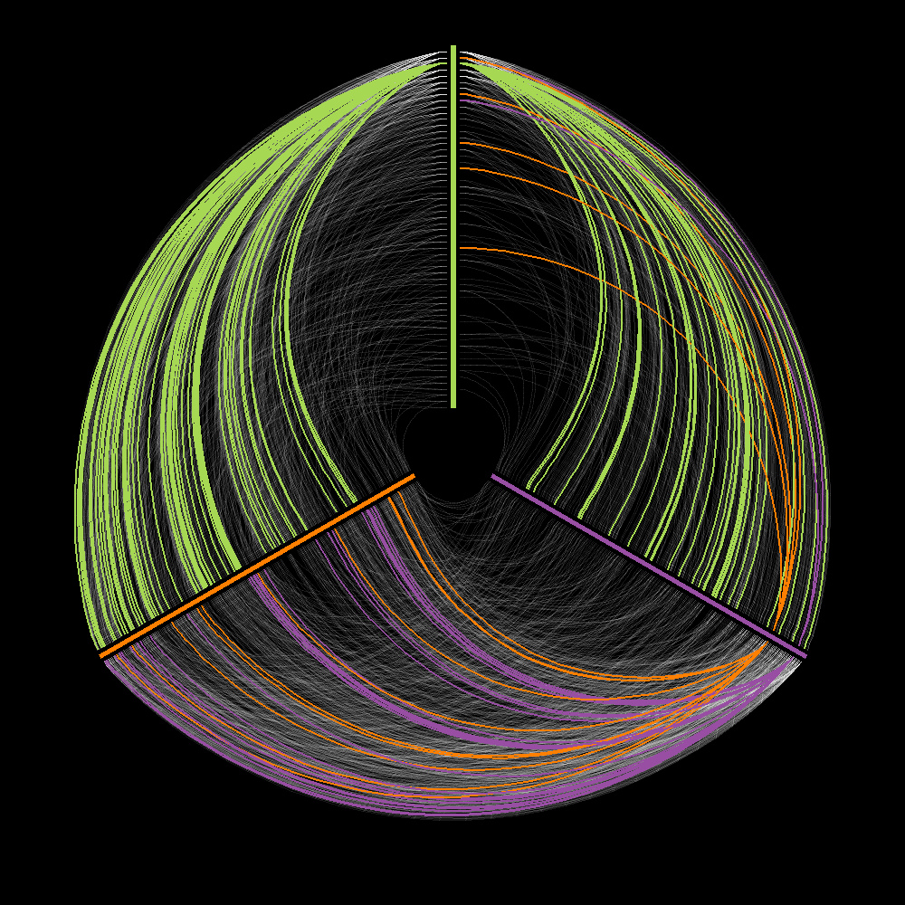

!SLIDE 
# Grokking Apache Logs with R

!SLIDE
# What is R?

!SLIDE
# A programming language

* Optimized for statistics
* Built-in language features, types, libraries

!SLIDE
# An IDE and REPL

RStudio is my favorite interface

!SLIDE full-page

!SLIDE
# A Massive Ecosystem

CRAN : R :: CPAN : Perl

!SLIDE full-page

