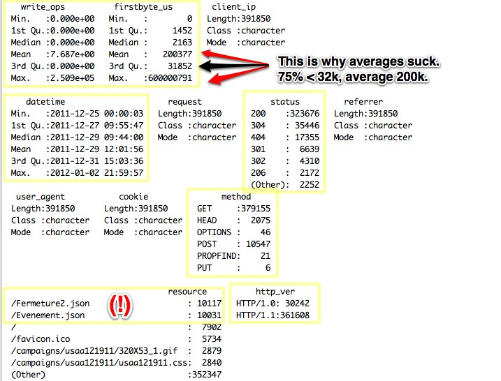
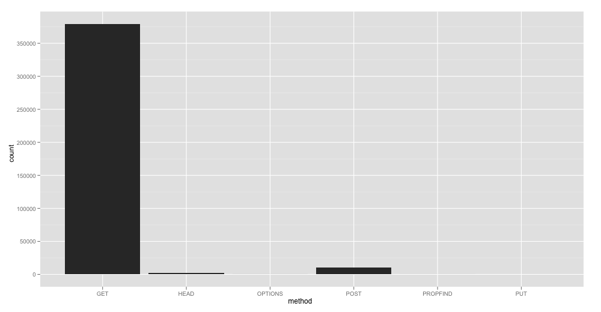
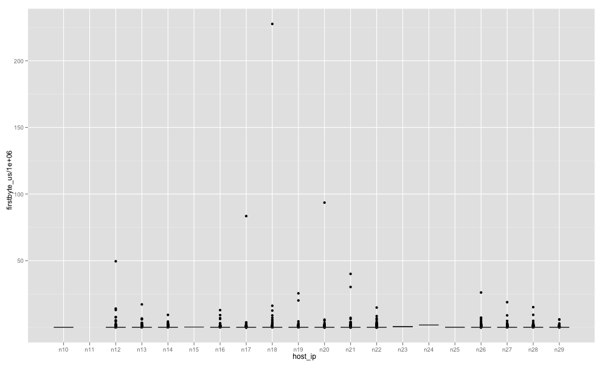
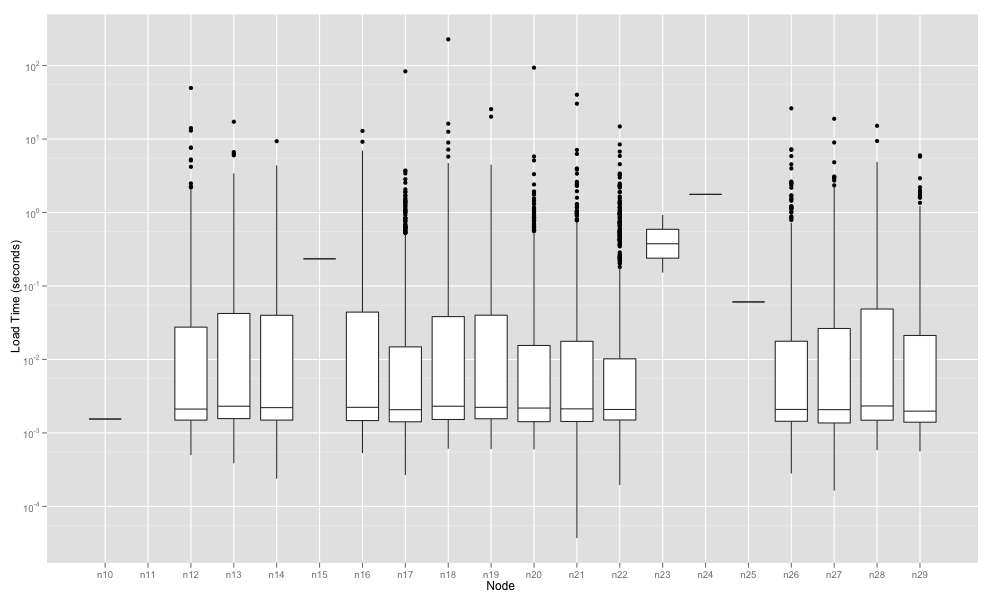
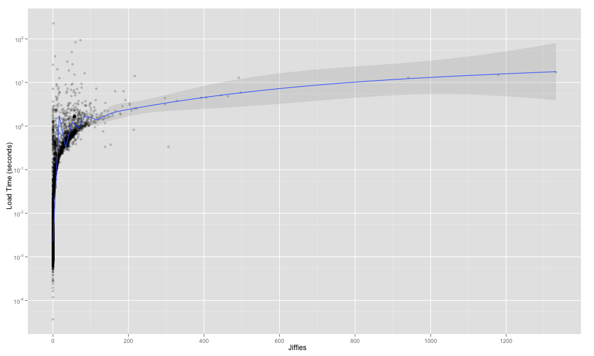
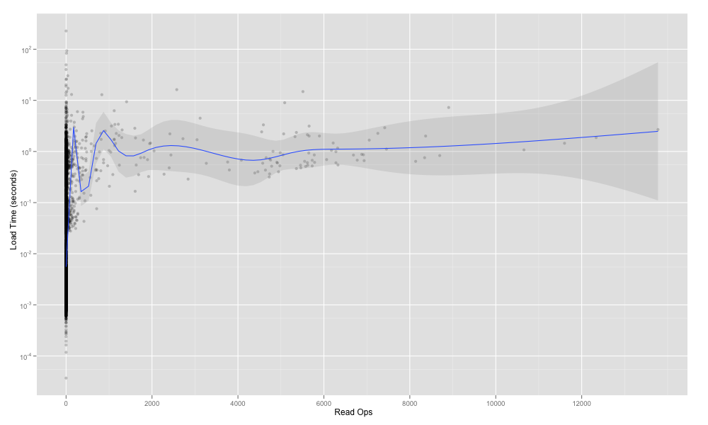
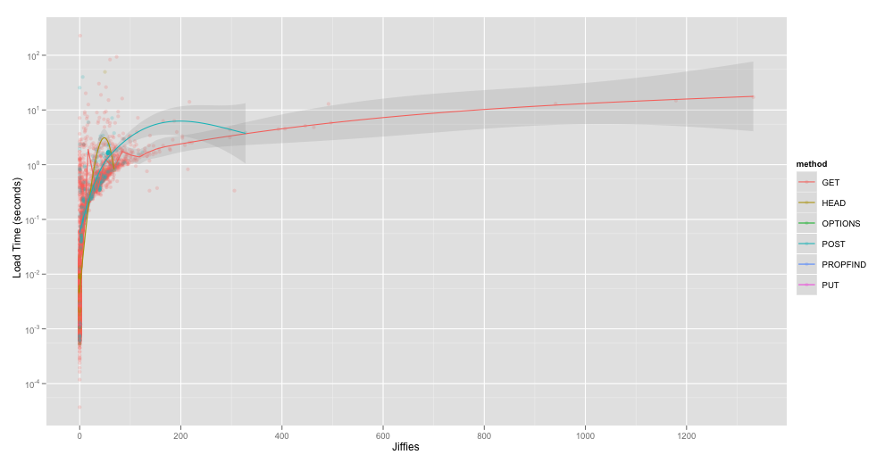
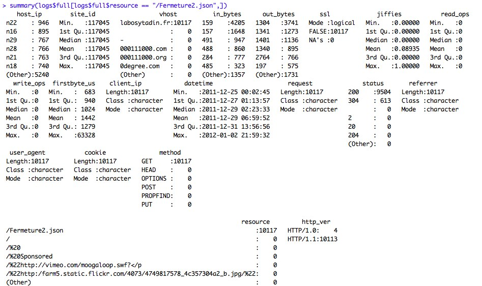
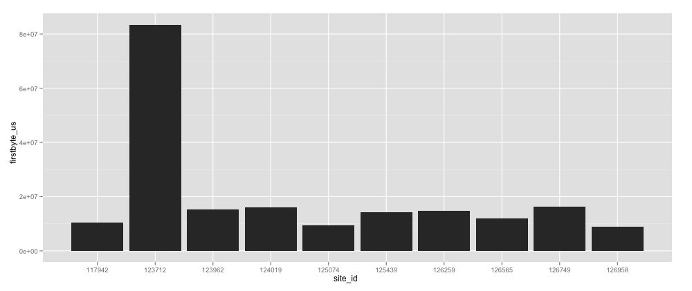
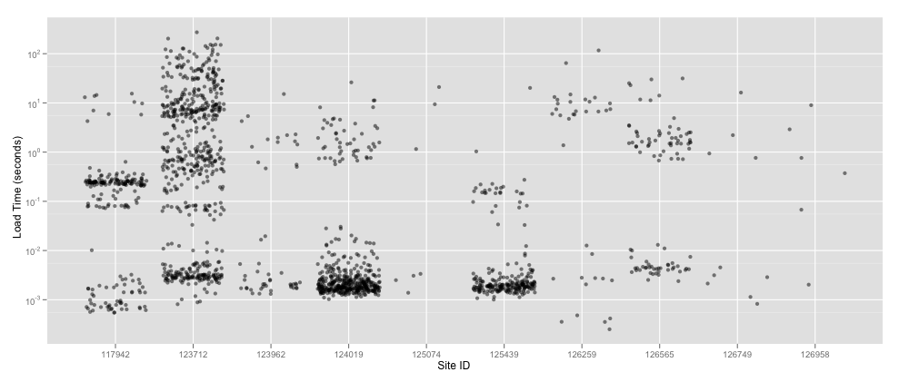

!SLIDE
# The grokking can begin!
`> summary(full_logs)`

!SLIDE commandline incremental
# One little problem

    $ qplot(datetime, firstbyte_us, data=full_logs)
    $ ....
    $ (gets coffee)
    $ (bathroom)
    $ (surfs http://planetr.stderr.org/)
    $ ^C

!SLIDE

# Too much data

### (*for some tasks*)

!SLIDE commandline incremental
# "`:`" and `sample`

    $ 1:10
    [1]  1  2  3  4  5  6  7  8  9 10
    $ sample(1:10, 3, replace=FALSE)
    [1] 10  9  6
    $ sort(sample(1:10, 3))
    [1]  7  8 10
    $ nrow(full_logs)
    [1] 391850 
    $ short_logs <- full_logs[
      sort(sample(1:nrow(full_logs), 10^4,
      replace=FALSE)),]
    $ system.time(
      qplot(jiffies, firstbyte_us, data=short_logs))
     user  system elapsed 
     0.042   0.015   0.063

!SLIDE code smaller
# Bake it in

    # subset the data to make it easier to work with 
    logs.small <- logs.full[
      sort(sample(
        1:nrow(logs.full), 10^4,
        replace=FALSE)),]
    return(
      list(small=logs.small, 
      full=logs.full))
    ...
    logs$small$jiffies

!SLIDE commandline incremental
# It's not the same!
### Still good for finding grok-worth questions faster.

    $ quantile(logs$small$jiffies, c(.5, .8, .9, .95, .99))
    50% 80% 90% 95% 99% 
      0   4  30  49  90 
    $ quantile(logs$full$jiffies, c(.5, .8, .9, .95, .99))
    50% 80% 90% 95% 99% 
      0   4  27  47  88 # close, but not quite the same 

!SLIDE incremental

# Where are the pretty pictures, dude?
* Meet `qplot`
  * `library(ggplot2)`

!SLIDE

`qplot(method, data=logs$full)`

!SLIDE 

`qplot(host_ip, firstbyte_us/1000000, data=logs$small, geom = "boxplot")`

!SLIDE 

`qplot(host_ip, firstbyte_us/1000000, data=logs$small, geom = "boxplot") + scale_y_log10() + ylab("Load Time (seconds)") + xlab("Node")`

!SLIDE 

`qplot(jiffies, firstbyte_us/1000000, data=logs$small, geom= c("point", "smooth"), span=1, alpha=I(1/5)) + scale_y_log10() + ylab("Load Time (seconds)") + xlab("Jiffies")`

!SLIDE

`qplot(read_ops, firstbyte_us/1000000, data=logs$small, geom= c("point", "smooth"), span=1, alpha=I(1/5)) + scale_y_log10() + ylab("Load Time (seconds)") + xlab("Read Ops")`

!SLIDE

`qplot(jiffies, firstbyte_us/1000000, data=logs$small, geom= c("point", "smooth"), span=1, alpha=I(1/5), colour=method) + scale_y_log10() + ylab("Load Time (seconds)") + xlab("Jiffies")`

!SLIDE
# Remember this?
`> summary(full_logs)`

!SLIDE full-page
# `summary` is awesome

!SLIDE
# The `reshape` package

* `melt` and `cast`
* Aggregate data however you'd like
* Let's just look at it

!SLIDE code smaller
# MELT IT DOWN

    > mdata <- melt(logs$small, id="site_id", 
       measure=c("in_bytes",
    > "out_bytes", "jiffies", "read_ops", 
      "write_ops"), na.rm=TRUE)
    > summary(mdata)
        site_id            variable         value      
     Min.   :110320   in_bytes :10000   Min.   :    0  
     1st Qu.:117877   out_bytes:10000   1st Qu.:    0  
     Median :121470   jiffies  :10000   Median :    0  
     Mean   :121155   read_ops :10000   Mean   : 5728  
     3rd Qu.:124300   write_ops:10000   3rd Qu.: 1704  
     Max.   :129863                     Max.   :56364  

!SLIDE code smaller
# Cast for great grokkage

    > cdata <- cast(mdata, site_id~variable, sum)
    > cdata[order(cdata$jiffies, decreasing=TRUE)[1:10],]
         site_id in_bytes out_bytes jiffies read_ops write_ops
    1639  126187    41240    696000    2269        0         0
    908   121470   189328   3368712    2039     3456     27920
    767   120356    19391    412424    1863     1256         0
    1631  126148   204723   3377856    1789        0         0
    1655  126259      268     29089    1179     5512      6664
    452   118000    91790   1872587    1009      360       712
    439   117942     5898    146772     976      128         0
    20    115300   234988   3802530     939      312       104
    888   121342    75593   1262762     898     5080        24
    150   116019    30009    552516     740       16         0

!SLIDE code smaller
# Use for all kinds of stuff. 
## "Consistently Slow"

    > laggards <- melt(logs$small, id="site_id", 
      measure="firstbyte_us", na.rm=TRUE)
    > cast_laggards <- cast(laggards, site_id~variable, 
        function(x) quantile(x, 0.95))
    > cast_laggards[order(cast_laggards$firstbyte_us,
    > decreasing=TRUE)[1:10],]
         site_id firstbyte_us
    1210  123712     83460525
    1727  126749     16210682
    1271  124019     15914227
    1260  123962     15154703
    1655  126259     14842918
    1514  125439     14166428

!SLIDE

`lag <- cast_laggards[order(cast_laggards$firstbyte_us, decreasing=TRUE)[1:10],]`
`lag$site_id <- as.factor(lag$site_id)`
`qplot(site_id, firstbyte_us, data=lag, geom="bar")`

!SLIDE code smaller
# Tell me more!

    > slow_sites <- subset(logs$full, site_id %in% lag$site_id,
     select=c(site_id, firstbyte_us))
    > slow_sites$site_id <- as.factor(slow_sites$site_id)
    > qplot(site_id, firstbyte_us/1000000, data=slow_sites,
     geom="jitter", alpha = I(1/2)) + scale_y_log10() 
     + xlab("Site ID") + ylab("Load Time (seconds)")

!SLIDE

